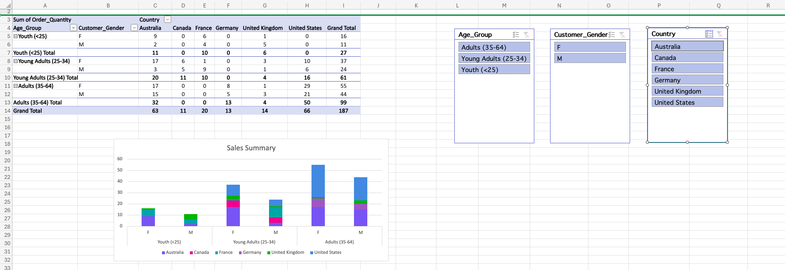

# 📊  Excel-Bike-Sales-Database

This project is an Excel-based analysis of a bike sales dataset.  
It demonstrates my skills as an **Entry-Level Data Technician**, focusing on essential data-cleaning, analysis, and visualization techniques using Excel’s core features.

---

## 🎯 Project Overview
The goal of this project is to practice creating pivot tables in Microsoft Excel and interactive slicers.They provide a way to automatically summarize, analyze, explore, and present data. Charts add visualizations to the data in the pivot table that analyze trends and comparisons.

---

## 🧰 Skills & Techniques Used

### 🎛️ **Pivot Tables**
I built multiple pivot tables to summarize sales by:
- Year 
- Age Group
- Country
- Order Quality

These pivot tables help extract insights from the dataset efficiently.

### 📈 Vizualizing Pivot Tables
I presented the pivot table as a graphical chart to visualize the summarized data, making it easier to interpret trends and comparisons, and assist in analysis and decision making.

### 🧩 **Slicers**
Interactive slicers were added to allow quick filtering of pivot table results, improving the usability of the report.

---

## 📄 Project Files
- **Excel Workbook:** Contains raw data, pivot tables, slicers, and charts.
- **Images Folder** Contains all the screeshots using for this README.
 
---

## 🚀 What This Project Demonstrates
- Ability to clean, structure, and analyze data in Excel  
- Use of dynamic functions to create flexible views  
- Building pivot tables for business insights  
- Applying conditional formatting for clarity  
- Creating charts and interactive elements to improve data exploration  
